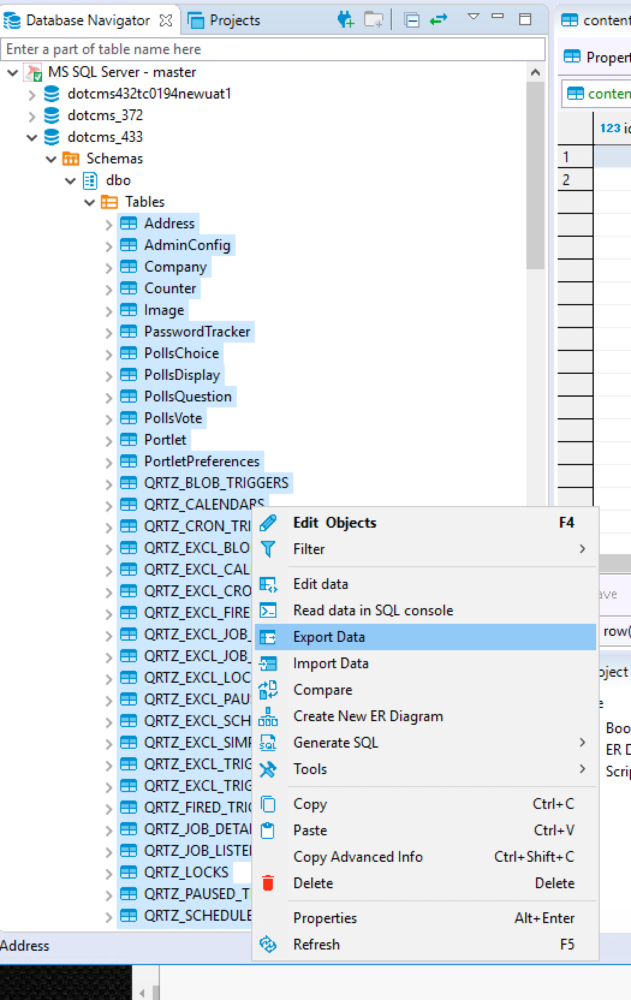
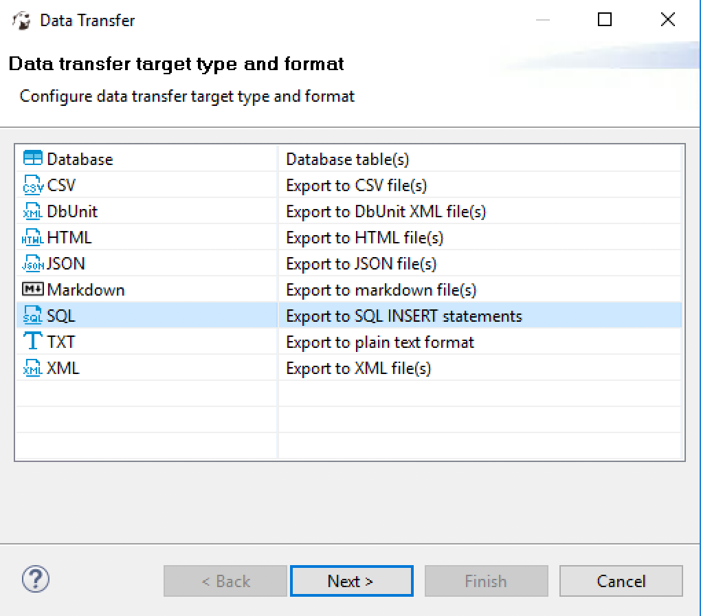
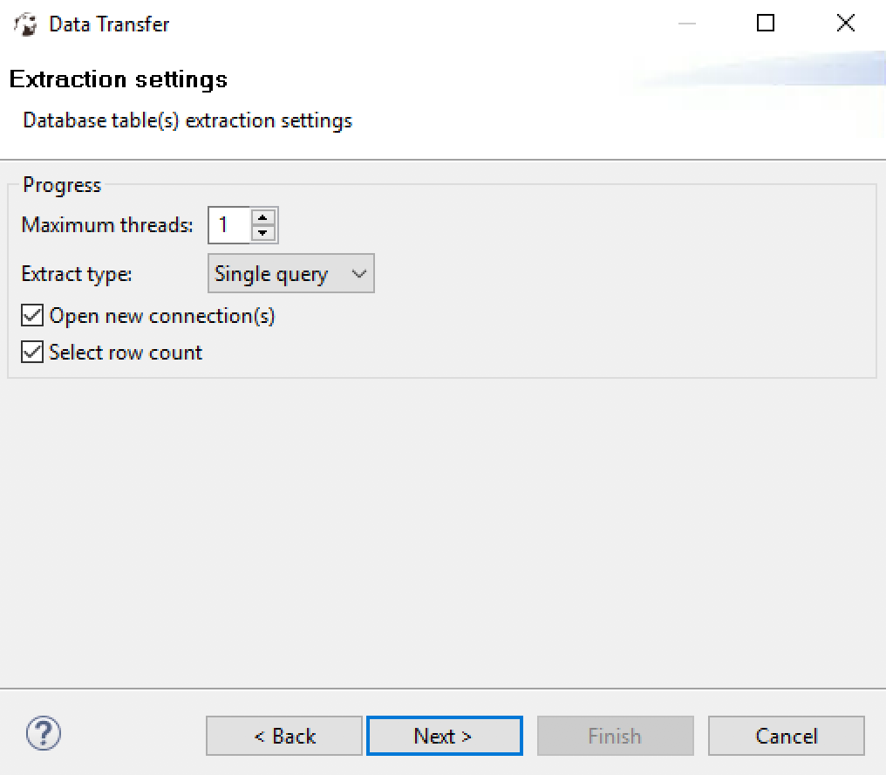
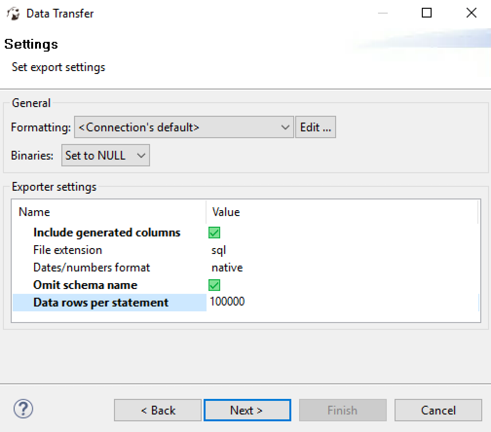
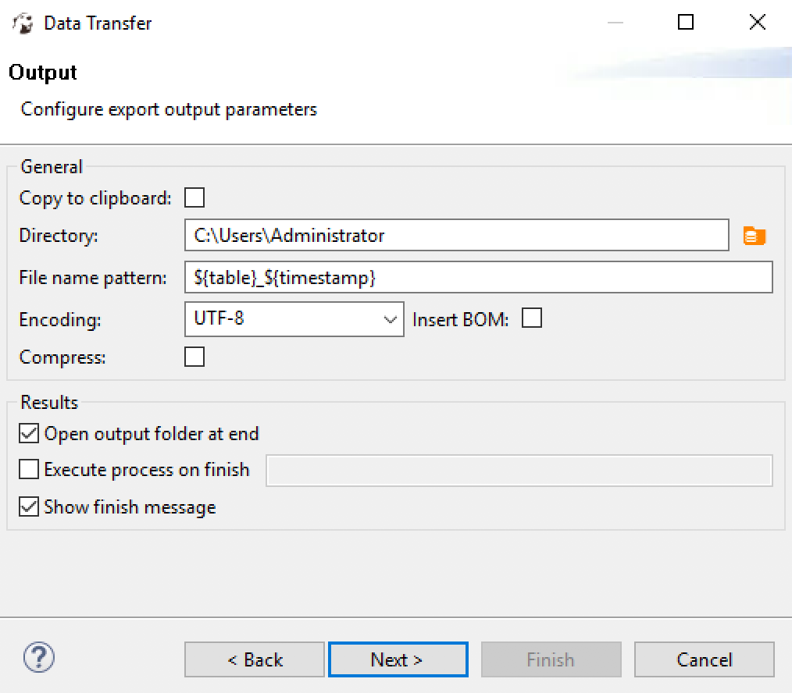
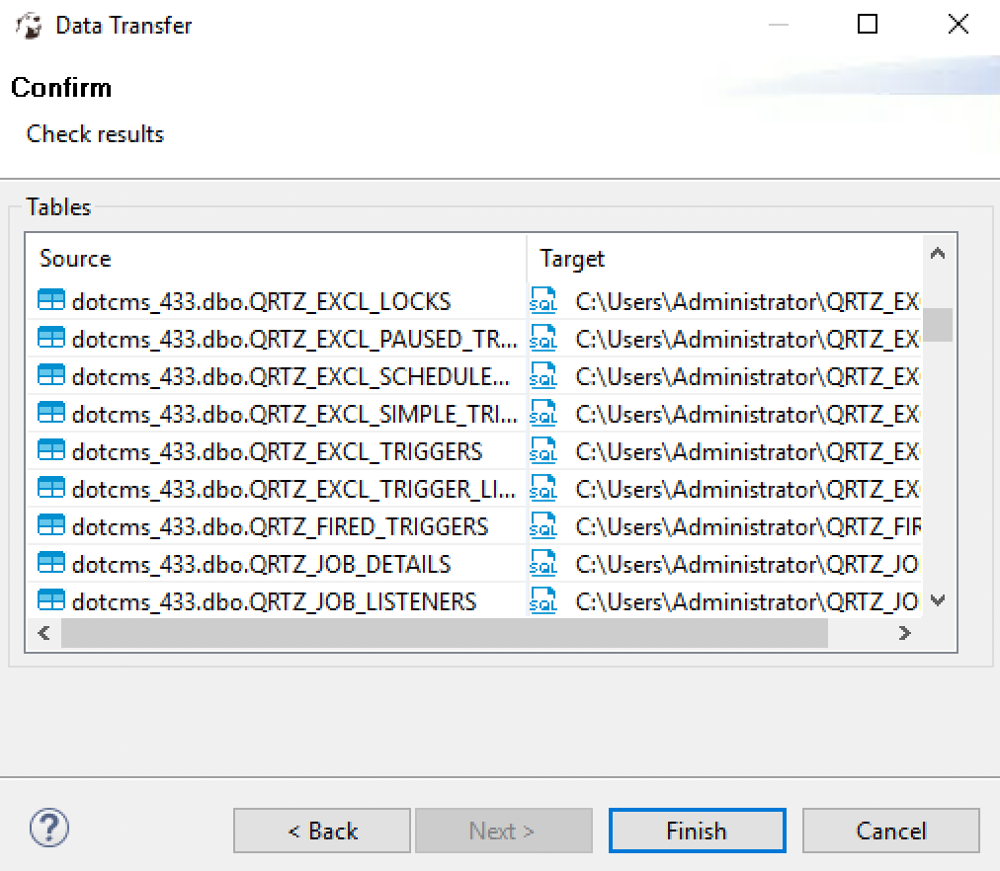

# Migrating you dotCMS database to Postgres
While dotCMS can run on different databases, dotCMS Co has internally standardized our cloud instances on Postgres, the most advanced and scaleable open source database in the world.  Whenever possible, we recommend running dotCMS on Postgres for the best possible dotCMS experience.

## Caveat Emptor
The database migration process and scripts supplied are intended as best efforts examples only.  They are not supported or warrentied to work and YMMV and all that.

## Preparing the data

### Generating the database schema and necessary files
There's no need to do this each time, the generated files can be re-used multiple times, the list of steps is for reference only. The actual files for each version can be found in the [schemas](schemas/) directory.

#### List of steps

1. Run a starter site using a Postgres database

2. Once the database is fully loaded, stop dotCMS

3. Generate a schema-only backup

```bash
pg_dump -U <db_username> -v -Fc -s -f <output_file> <database_name>
# e.g.
pg_dump -U postgres -v -Fc -s -f schema-only.sql dotcms
```

This will create a file called `schema-only.sql` which will be used later to load an empty database.

5. Create a non-privileged user and grant all privileges on that database

```SQL
CREATE USER dotcmsdbuser WITH PASSWORD 'randompassword';
GRANT ALL PRIVILEGES ON DATABASE dotcms to dotcmsdbuser;
```

6. Create two files with a prepared statement to  generate the constraints drops and creates:

A file called `generate-constraint-drops.sql`:

```sql
SELECT 'ALTER TABLE "'||nspname||'"."'||relname||'" DROP CONSTRAINT "'||conname||'";'
 FROM pg_constraint
 INNER JOIN pg_class ON conrelid=pg_class.oid
 INNER JOIN pg_namespace ON pg_namespace.oid=pg_class.relnamespace
 ORDER BY CASE WHEN contype='f' THEN 0 ELSE 1 END,contype,nspname,relname,conname;
```

And then execute it:

```bash
PGUSER=dotcmsdbuser psql dotcms < generate-constraint-drops.sql > constraint-drop.sql
```

A file called `generate-constraint-create.sql`:

```sql
SELECT 'ALTER TABLE "'||nspname||'"."'||relname||'" ADD CONSTRAINT "'||conname||'" '||
   pg_get_constraintdef(pg_constraint.oid)||';'
 FROM pg_constraint
 INNER JOIN pg_class ON conrelid=pg_class.oid
 INNER JOIN pg_namespace ON pg_namespace.oid=pg_class.relnamespace
 ORDER BY CASE WHEN contype='f' THEN 0 ELSE 1 END DESC,contype DESC,nspname DESC,relname DESC,conname DESC;
```

And then execute it:

```bash
PGUSER=dotcmsdbuser psql dotcms < generate-constraint-create.sql > constraint-create.sql
```

**Erase** the first and the last two lines of both files `constraint-create.sql` and `constraint-drops.sql`.

At the end of this step, two files were generated: `constraint-create.sql` and `constraint-drops.sql`. This two files are going to be run on the newly migrated database before and after exporting the data. This two files can also be found inside the dotCMS version directory [here](schemas/).

### Generating the data backup on MSSQL

A **very important notice**: The data to be migrated needs to be in version **4.3.3** prior to run this script. The following steps can be run from the database server itself or from a remote computer. Steps:

1. Install [dbeaver community](https://dbeaver.io/)

2. Connect to the database server containing the data that's going to be migrated

3. Select all the tables, right-click on the selection and choose "Export Data" and use the screenshots as a guide for configuring the rest of the steps.

**Data export**


**Chose the format**


**Extraction settings**


**Export settings**


**Output parameters**


**Check results**


4. The output of this backup will be one file for each table

5. Copy the script `sqlgone.sh` to the place were all the individual files were generated and run it

6. This will generate a file called `all-data.sql`. This file contains all the data in postgres-friendly format, it's going to be used later.

## MySQL Tasks 
Once you have the `all-data.sql` file please run the following commands to remove the \` (backquote) used for MySQL on reserverd workds:
```bash
sed -i 's/`type`/type/g' all-data.sql
sed -i 's/`language`/language/g' all-data.sql
sed -i 's/`structure`/structure/g' all-data.sql
sed -i 's/`system`/system/g' all-data.sql
sed -i 's/`key`/key/g' all-data.sql
sed -i 's/`action`/action/g' all-data.sql
sed -i 's/`float4`/float4/g' all-data.sql
sed -i 's/`float8`/float8/g' all-data.sql
sed -i 's/`day`/day/g' all-data.sql
sed -i 's/`month`/month/g' all-data.sql
sed -i 's/`year`/year/g' all-data.sql
sed -i 's/`cardinality`/cardinality/g' all-data.sql
```
In case you need to delete the carriage return run:
```
sed -i 's/\r//g' all-data.sql
```


## Restoring the data
After completing all the above steps, everything is ready for restoring the data.

1. Create the database using the `schema-only.sql` file generated in the previous sections.

```bash
pg_restore -U <db_username> -v -d <database_name> <dump_file>
# For example
pg_restore -U postgres -v -d dotcms schema-only.sql
```

2. Drop all the constraints on the database using the `constraint-drop.sql` file generated in the previous sections.

```bash
PGUSER=dotcmsdbuser psql dotcms < constraint-drop.sql
```

3. Change the pg_cast to support numeric boolean values

MSSQL uses a different representations for boolean values, and even though PostgreSQL supports multiple types of characters, it doesn't support integers. Before loading the script we need to change the *pg_cast* behaviour so it accepts integers instead of chars.

**Connect** to the dotcms database and then run:

```SQL
\c dotcms
UPDATE pg_cast SET castcontext='a' WHERE casttarget = 'boolean'::regtype;
```

4. Temporarily disable the trigger on `identifier` table:

```SQL
ALTER TABLE identifier DISABLE TRIGGER USER;
ALTER TABLE htmlpage DISABLE TRIGGER USER;
```

***
* **ORACLE ONLY**: Additional steps if migrating from Oracle

- Add a dummy function called TO_CLOB. Oracle uses this function but postgres doesn't require it. This function only returns its own argument.
```sql
\c dotcms
CREATE FUNCTION TO_CLOB(data text) RETURNS text AS $$
BEGIN
RETURN data;
END; $$
LANGUAGE PLPGSQL;
```

It needs to be removed once the data is loaded.

- Check the error output, sometimes some of the column names are between double quotes "", from the experience it happens rarely and there are not so many cases. It's better to deal with them manually by modifying `all-data.sql` file directly.

* **/ORACLE ONLY**
***

5. Load the data in using the `all-data.sql` script created in previous sections.

```bash
# And then load the script
PGUSER=dotcmsdbuser psql dotcms < all-data.sql 2> err.txt
```

6. Set the pg_cast back to normal:

```SQL
\c dotcms
UPDATE pg_cast SET castcontext='e' WHERE casttarget = 'boolean'::regtype;
```

7. Set the trigger on `identifier` back to normal:

```SQL
ALTER TABLE identifier ENABLE TRIGGER USER;
ALTER TABLE htmlpage ENABLE TRIGGER USER;
```

8. Restore the constraints

```sql
PGUSER=dotcmsdbuser psql dotcms < constraint-create.sql
```

9. Startup dotCMS: **Reindex & Test**

10. Enjoy!

## Special notes, caveats, troubleshooting

List of some project specific tasks that can be used as reference:

### Oracle to Postgres

1. Updating an index:

Got this error when migrating the data:
```sql
ERROR:  relation "dr$tag_user_id_index$r" does not exist
LINE 1: INSERT INTO "dr$tag_user_id_index$r" (ROW_NO,DATA) VALUES
                    ^
```
The relation `dr$tag_user_id_index$r` is actually an index, this can be ignored or removed from the data file.

2. Broken html pages:

The error:
```sql
ERROR:  insert or update on table "htmlpage_version_info" violates foreign key constraint "fk_htmlpage_version_info_working"
DETAIL:  Key (working_inode)=(975964f8-ef1f-451a-aa23-10a44c39ce98) is not present in table "htmlpage".
ERROR:  insert or update on table "htmlpage_version_info" violates foreign key constraint "fk_htmlpage_version_info_live"
DETAIL: Key (live_inode)=(975964f8-ef1f-451a-aa23-10a44c39ce98) is not present in table "htmlpage".
```

There was only one row on each of those tables, at this point we just deleted them to let the data load correctly.
